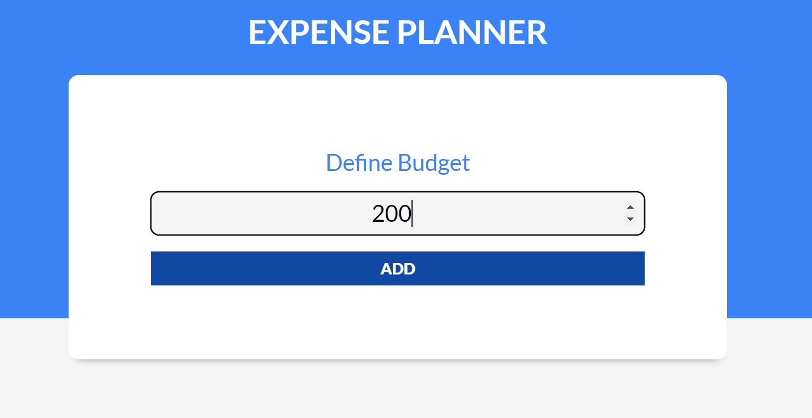
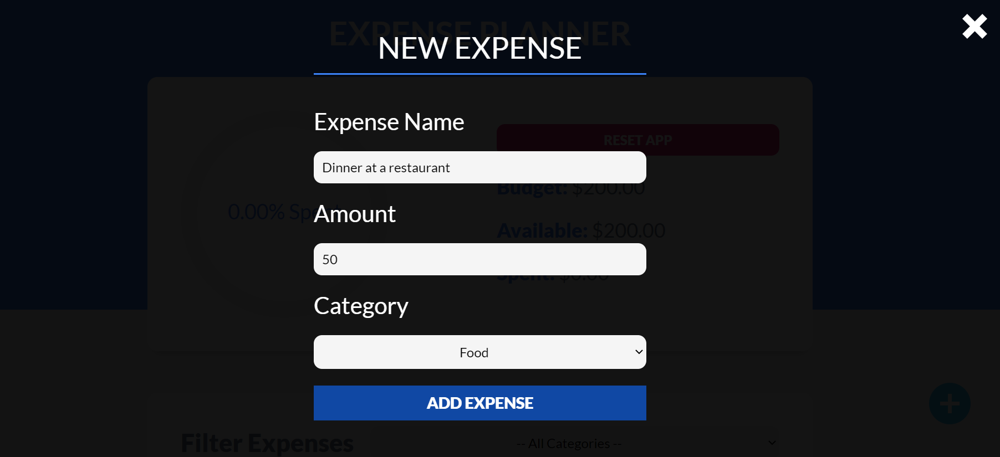
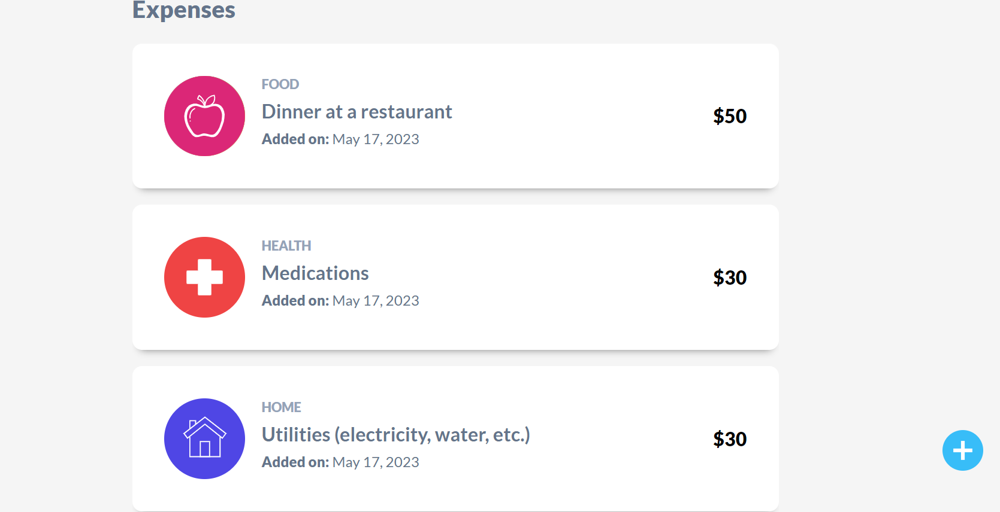
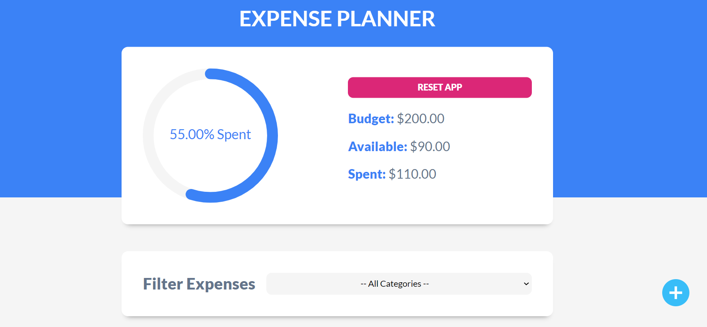
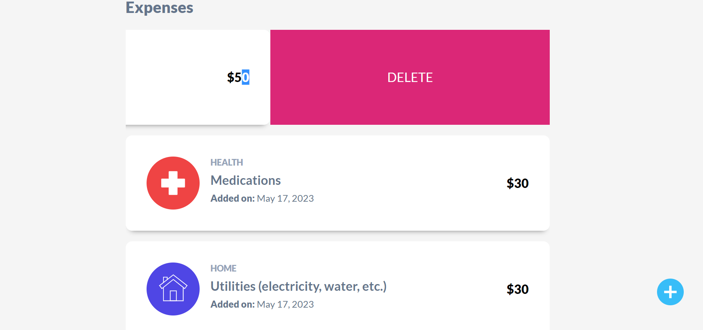
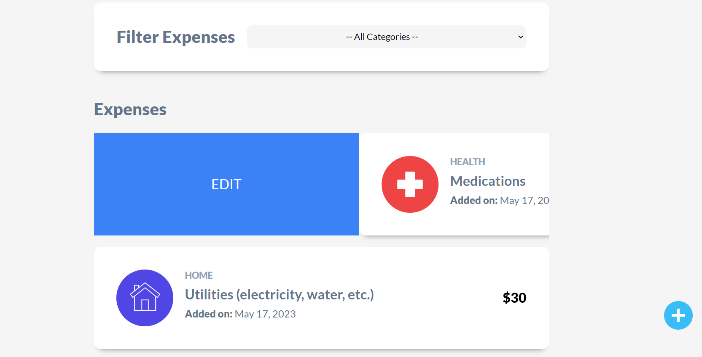

# Budget Control!

<table>
    <tr>
        <td width="50%">
            
             
            
Define Budget

        </td>
        <td width="50%">
            
             
            
Modal Expense

        </td>
    </tr>
    <tr>
        <td width="50%">
            
             
            
Expenses List

        </td>
        <td width="50%">
            
             
            
Circular Progress Bar Spent

        </td>
    </tr>
    <tr>
        <td width="50%">
            
             
            
Delete Expense

        </td>
        <td width="50%">
            
             
            
Edit Expense

        </td>
    </tr>
</table>

## Built with:

  

- **Frontend**: ReactJS, CSS
- **Hosting**: Netlify

## Features

- Budget management
- Editing, deletion, and category filtering
- Progress visualization

